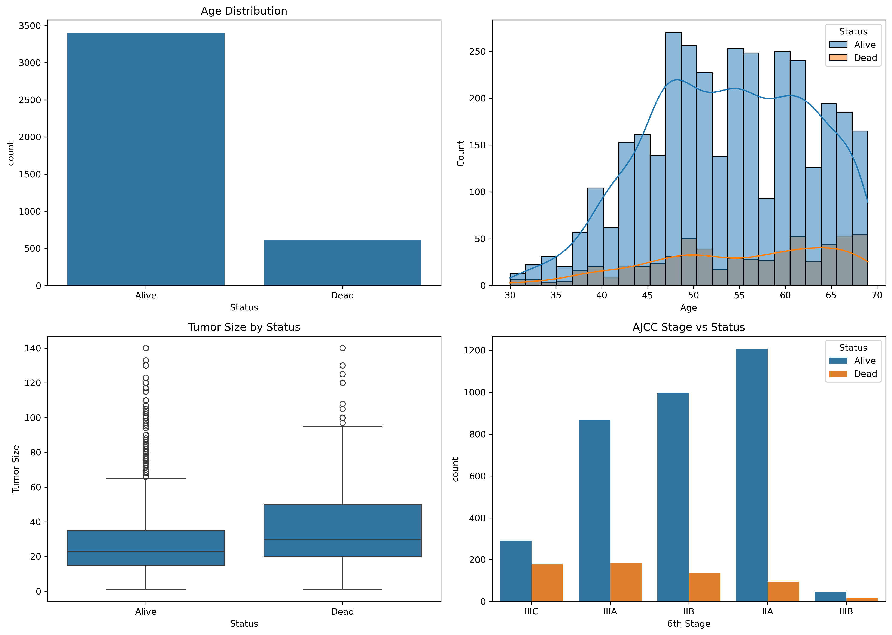
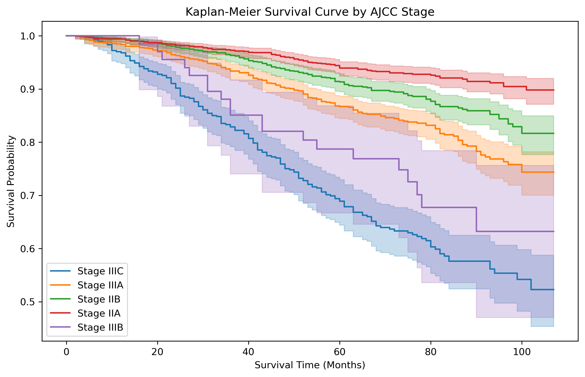
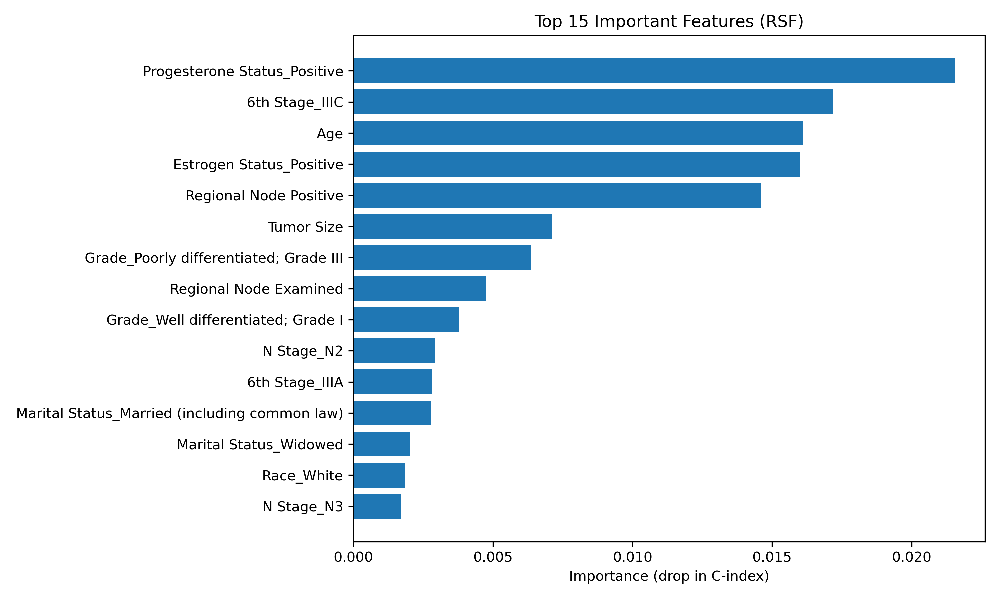

# SEER 乳腺癌生存分析

基于 SEER 公开数据库中 4023 例乳腺癌患者的临床数据，构建生存分析模型，识别影响患者生存的独立预后因素。

## 技术路线

- 数据清洗：去重、异常值处理、分类变量 One-Hot 编码
- Kaplan-Meier 生存曲线 + log-rank 检验
- Cox 比例风险回归（识别独立预后因素，C-index = 0.744）
- Random Survival Forest（机器学习模型）

## 主要发现

- ER 阳性（HR=0.50）和 PR 阳性（HR=0.64）是独立保护因素
- Grade IV（HR=2.90）是最强危险因素，其次为 T4（HR=1.82）、N2（HR=1.52）

## 结果图

## 环境

Python 3.12 · lifelines · scikit-survival · pandas
